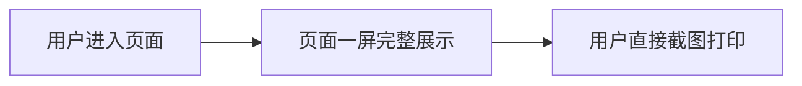

# 清朝帝王知识点链式展示网页 PRD（更新版）

## 1. 产品概述
本产品是一个简洁清晰的历史知识展示网页，以卡片链式布局一屏完整呈现清朝十二帝的核心信息，专为截图黑白打印优化。
- 目标用户：历史学习者、学生及历史爱好者
- 核心价值：一屏完整展示清朝帝王世系传承，黑白打印效果清晰，便于保存和学习

## 2. 核心功能

### 2.1 功能模块
1. **主页面**：标题区、帝王卡片链展示区（一屏完整显示，无需滚动）

### 2.2 页面详情
| 页面名称 | 模块名称 | 功能描述 |
|----------|----------|----------|
| 主页面 | 标题区 | 展示页面标题「清朝十二帝」 |
| 主页面 | 帝王卡片链 | 以横向链式布局一屏展示12位皇帝卡片，卡片间通过连接线串联 |
| 主页面 | 帝王卡片 | 每张卡片包含：庙号、年号、姓名、在位年限、主要功绩摘要 |

## 3. 核心流程
用户进入页面即可一屏看到全部12位帝王卡片，横向链式排列，用箭头或连接线表示传承顺序。

## 4. 用户界面设计
### 4.1 设计风格（黑白打印优化）
- **配色原则**：黑白灰配色，高对比度，确保黑白打印效果清晰
  - 背景：纯白色或极浅灰色
  - 文字：纯黑色或深灰色
  - 边框：深灰色或黑色实线
  - 强调：通过粗体、字号大小、边框粗细来区分层次，不依赖颜色
- **卡片风格**：简洁矩形卡片，黑色边框，清晰留白，类似表格单元格的清晰感
- **字体选择**：使用系统无衬线字体或宋体，确保打印清晰易读
- **布局风格**：横向时间轴链式布局，12张卡片横向一字排开或排成两排（6+6），用箭头连接形成链条
- **链式连接**：使用简单的→箭头或连接线连接相邻卡片，清晰表示传承顺序

### 4.2 页面设计概览
| 页面名称 | 模块名称 | UI元素 |
|----------|----------|--------|
| 主页面 | 标题区 | 大号粗体黑色标题，居中 |
| 主页面 | 卡片链 | 横向排列的卡片，卡片间用→箭头连接，形成时间链条 |
| 主页面 | 帝王卡片 | 白底黑框，内容分层次：庙号年号（大号加粗）→ 姓名 → 在位年限 → 功绩 |

### 4.3 打印优化
- 所有内容在一屏内完整显示，无需滚动
- 使用打印友好的黑白配色
- 文字足够大且清晰，适合A4纸打印
- 避免使用阴影、渐变等打印效果差的样式
- 固定页面尺寸，确保截图时所有内容完整

### 4.4 布局方案
- 横向排列：12张卡片横向一字排开，可能需要横向滚动或紧凑布局
- 两排布局：上排6位（前期），下排6位（后期），中间用连接符转折
- 选择两排布局更适合屏幕显示和A4打印
