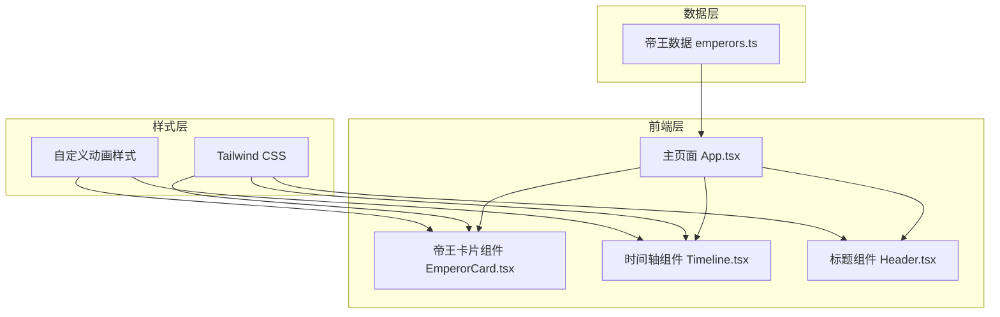

# 技术架构文档

## 1. 架构设计
本项目为纯前端单页应用，无后端服务。



## 2. 技术说明
- **前端框架**：html
- **样式方案**：Tailwind CSS@3
- **后端**：无
- **数据库**：无，使用静态 Mock 数据
- **状态管理**：本项目为静态展示页面，无需复杂状态管理

## 3. 路由定义
本项目为单页展示应用，仅需一个路由：

| 路由 | 用途 |
|------|------|
| / | 主页面，展示清朝十二帝卡片链 |

## 4. 项目结构
```
/Users/home/code/stud/
├── src/
│   ├── components/
│   │   ├── EmperorCard.tsx    # 帝王卡片组件
│   │   ├── Timeline.tsx       # 时间轴容器组件
│   │   └── Header.tsx         # 页面标题组件
│   ├── data/
│   │   └── emperors.ts        # 清朝十二帝数据
│   ├── App.tsx                # 主应用组件
│   ├── main.tsx               # 应用入口
│   └── index.css              # 全局样式和自定义动画
├── index.html                 # HTML入口
├── package.json
├── tailwind.config.js
├── postcss.config.js
├── tsconfig.json
└── vite.config.ts
```

## 5. 数据模型
### 帝王数据结构
```typescript
interface Emperor {
  id: string;           // 编号 A-L
  templeName: string;   // 庙号
  eraName: string;      // 年号
  personalName: string; // 姓名
  reignYears: string;   // 在位年限
  achievements: string; // 主要功绩
  order: number;        // 排序序号
}
```
